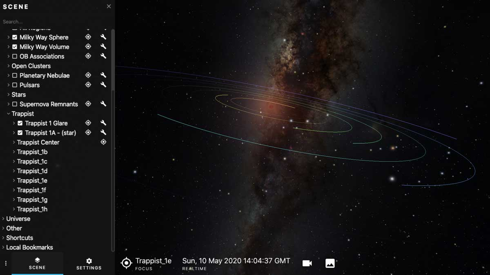
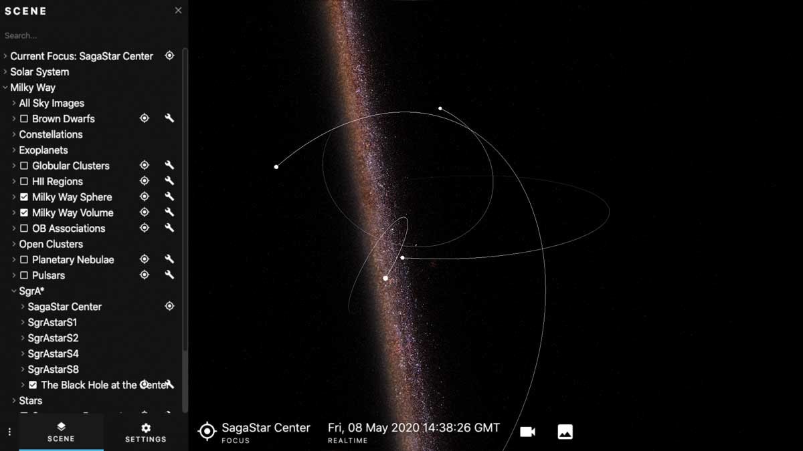

# addons

Some extra assets for OpenSpace

Included are:

The Trappist Planetary system

A model (obj) for the tesla roadster

A script to import galaxy coordinates from the Millennium Simulation results

An asset importer for the SgrA* system

