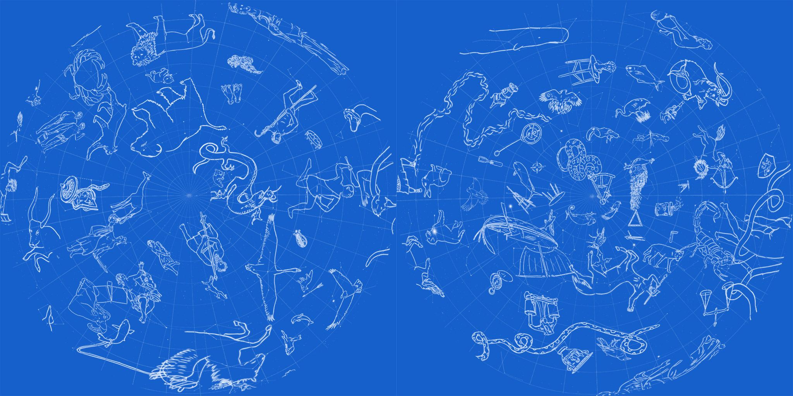
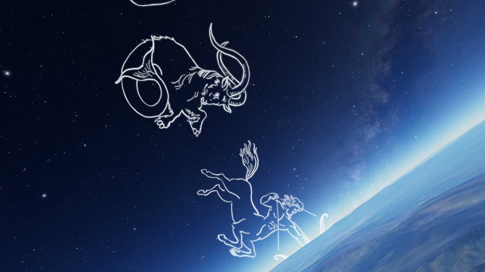
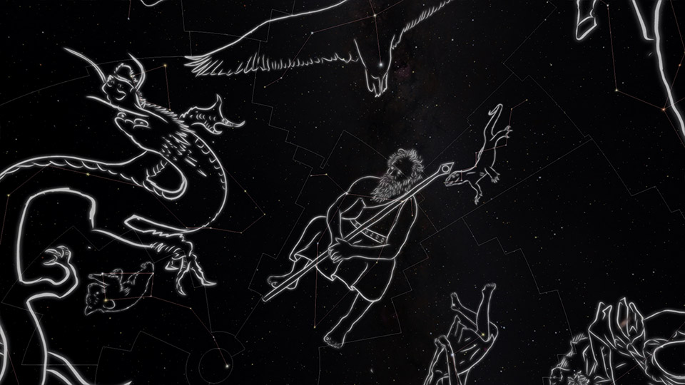
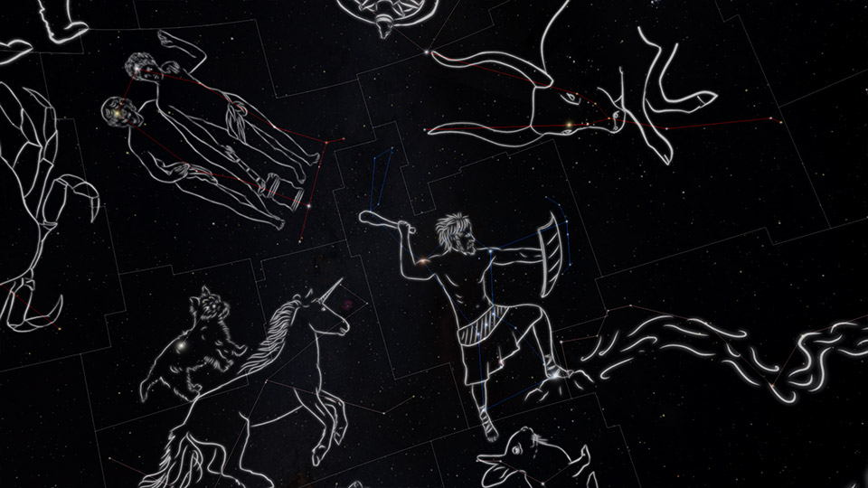
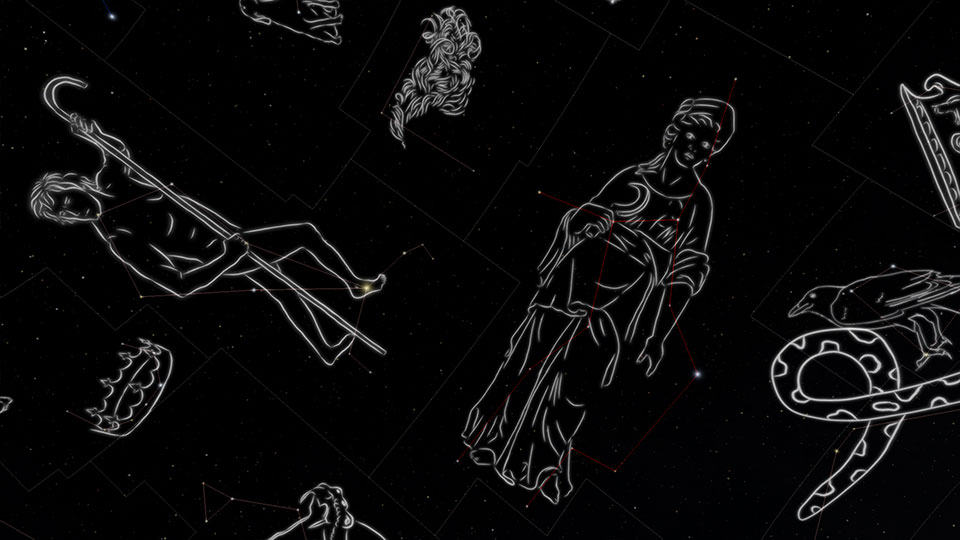

# Art for the constellations.

All 88 constellations are included as image textures.



This asset reads a csv file to determine the texture and position for each constellation individually.





By default they are off, but can be turned on using the gui or Lua commands.

To turn them all on or off:

```
openspace.setPropertyValue("{ConstellationArtImage}.Renderable.Enabled",true)
openspace.setPropertyValue("{ConstellationArtImage}.Renderable.Enabled",false)
```

The are also tagged to some degree, for example, the zodiac can be added alone.

```
openspace.setPropertyValue("{zodiac}.Renderable.Enabled",true)
```



TODO:

General improvements of drawings.
