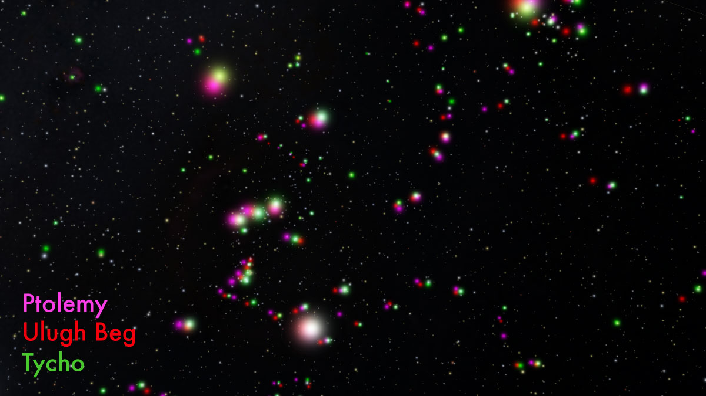
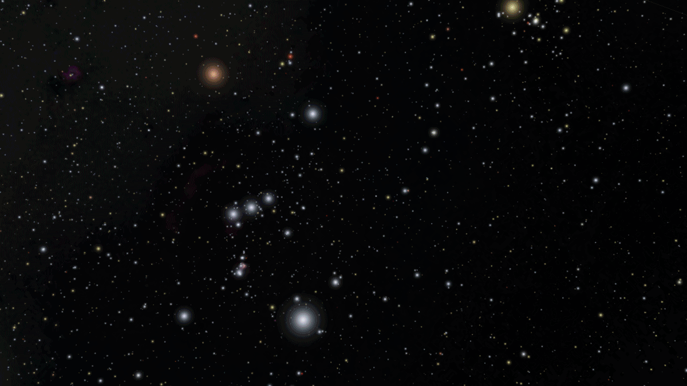
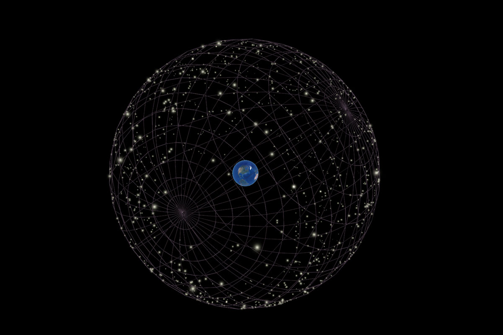

# Historical Star Catalogs

Adds three star catalogs from: Ptolemy, Ulugh Beg, and Tycho Brahe/Kepler using RenderableStars.

### All three star catalogs (plus the modern Hipparcos Survey)



Data processed and coordinates converted using the enclosed astropy scripts.

Equinox for Ptolemy is chosen as 58 AD

Equinox for Ulugh Beg is 1437

Equinox for Tycho is chosen as 1601 AD

Distances to stars were set at 10pc (completely arbitrary)

Data obtained from:

Ptolemy/Ulugh Beg:
[A&A Volume 544, August 2012](https://www.aanda.org/articles/aa/abs/2012/08/aa19596-12/aa19596-12.html)

Tycho/Kepler:
[A&A Volume 516, June-July 2010](https://www.aanda.org/articles/aa/abs/2010/08/aa14002-10/aa14002-10.html)

Usage:


```
asset.request('addons/historical-star-catalogs/historical-star-catalogs')
```

or individually:

```
asset.request('addons/historical-star-catalogs/almagest-stars-as-stars')
asset.request('addons/historical-star-catalogs/almagest_starlabels')
asset.require('addons/historical-star-catalogs/ulughbeg-stars-as-stars')
asset.require('addons/historical-star-catalogs/ulughbeg-starlabels')
asset.request('addons/historical-star-catalogs/tycho-stars-as-stars')
asset.request('addons/historical-star-catalogs/tycho_starlabels')
```

### Frames showing each data set around Orion


### The Almagest Stars on the Celestial Sphere

