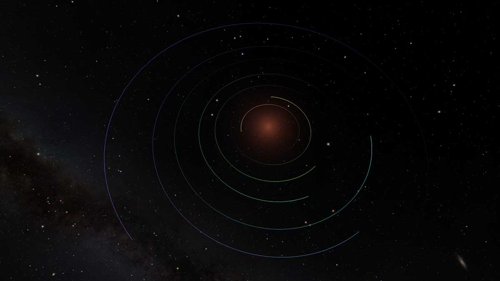
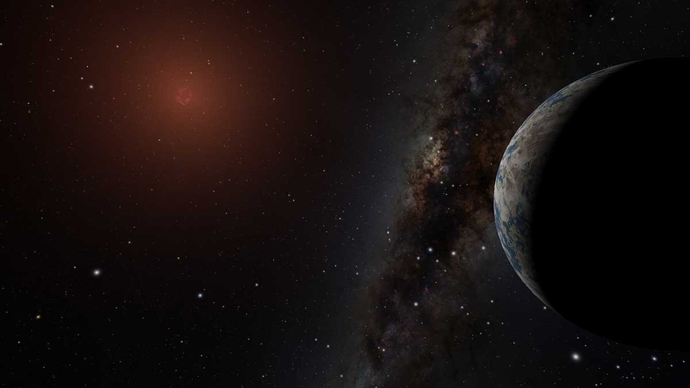

# Trappist System

The seven planets in the TRAPPIST-1 planetary system.

Orbital parameters adopted from [here](http://www.trappist.one/#system)

Simulated Planet textures from [here](https://caltech.app.box.com/s/a9kd2sxhirx59vds2dlx95f5rlmnhsec/folder/46298041428). Credit: NASA/JPL-Caltech/R. Hurt, T. Pyle (IPAC)

More information [here](http://www.spitzer.caltech.edu/trappist-1)

Example Images:

